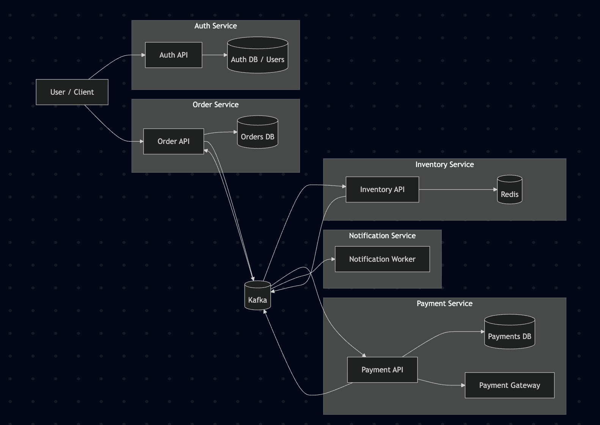
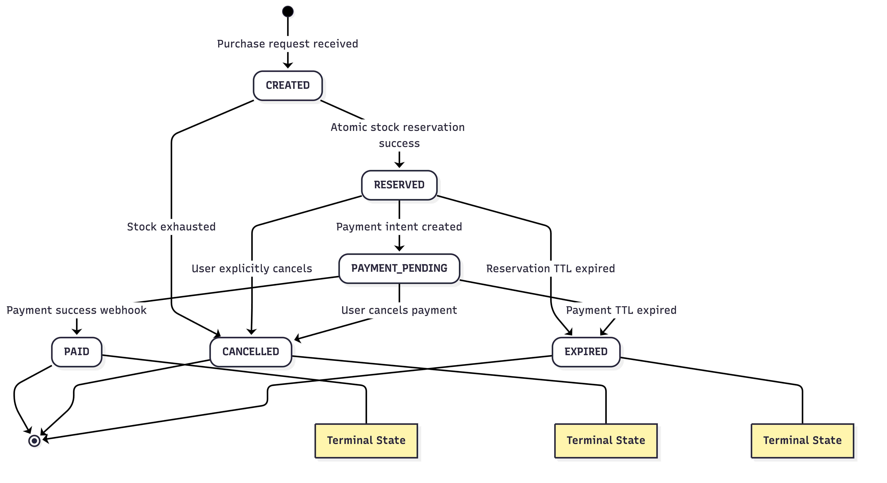
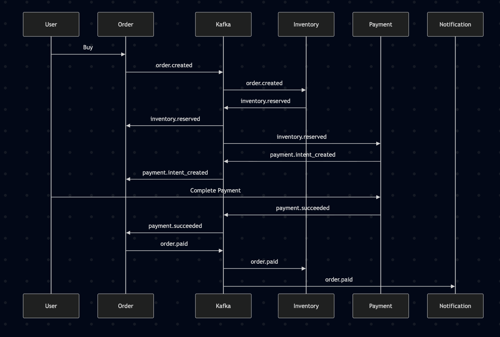
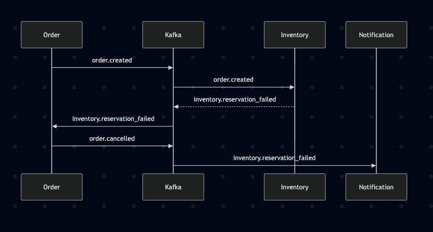
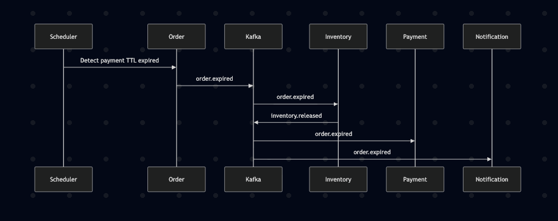
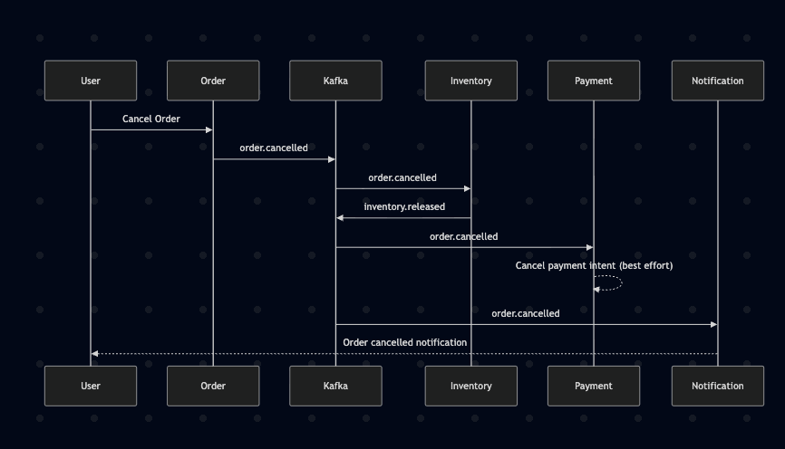
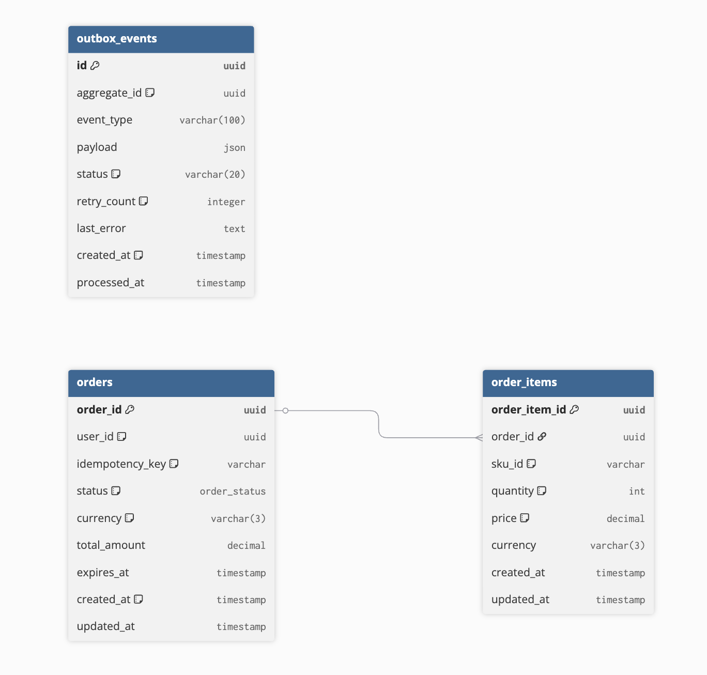

# FlashSaleWar - OrderService


**FlashSaleWar** is a high-concurrency microservices system designed to handle massive traffic spikes during flash sale events. This repository contains the **Order Service**, which acts as the central orchestrator for the order lifecycle using distributed consistency patterns.

## Service Scope

This repository currently contains only the **Order Service** of the FlashSaleWar system.

The following services are planned but not yet implemented:

- Inventory Service
- Payment Service

The project is currently in-progress and focused on demonstrating high-concurrency reliability patterns rather than full production deployment.

## System Architecture

The system utilizes an **Event-Driven Architecture** with **Saga Choreography** to manage distributed transactions across services such as Inventory and Payment.



### Core Reliability Patterns:
* **Saga Choreography**: Distributed transactions managed through local events and Kafka consumers.
* **Transactional Outbox Pattern**: Ensures atomicity between database updates and message publishing to Kafka. It uses `SELECT ... FOR UPDATE SKIP LOCKED` for high-performance, parallel polling across multiple worker pods.
* **Idempotency**: All consumers are designed to handle retries safely by using unique keys and verifying the current state before processing.
* **Optimistic Locking**: Prevent race conditions during concurrent retries or out-of-order events by database updates use an atomic guard (WHERE status = ?) to .

---

## Order Lifecycle & Event Flow

The order status follows a strict monotonic transition path to ensure data integrity.

### 1. State Machine Transitions
A visualization of the internal status transitions managed by the Order Service.


### 2. Happy Path Flow
This diagram illustrates the successful flow from order initiation to successful payment.


### 3. Failure & Compensation Scenarios (Sad Flows)
The system is built to handle various failure modes through compensating transactions:
* **Inventory Exhausted**: Handling stock-outs during high-concurrency reservation attempts.
    
* **Payment Timeout**: Automatic cancellation when a user fails to pay within the TTL.
    
* **User Cancellation**: Flow for manual order cancellation by the client.
    

---

## Database Schema

The schema is optimized for PostgreSQL to support row-level locking and JSON payloads for events.



### Primary Tables:
* **`orders`**: Tracks primary state, user identification, and idempotency keys.
* **`order_items`**: Stores immutable snapshots of item names, quantities, and prices at the time of purchase.
* **`outbox_events`**: Reliability buffer for outgoing Kafka messages.

---

## Project Structure
This project follows **Clean Architecture** principles to ensure high maintainability and testability through the separation of concerns:
```
cmd/
 ├── web/               → HTTP server entrypoint
 ├── outbox-worker/     → Outbox polling worker
 └── order-consumer/    → Kafka consumer

internal/
 ├── domain/            → Pure business rules & entities
 ├── application/       → Use cases & orchestration
 ├── delivery/          → HTTP & messaging adapters (inbound adapter)
 ├── infrastructure/    → Database & Kafka implementation (outbound adapter)
 ├── config/            → Dependency initialization
 └── shared/            → Utilities

migrations/             → SQL schema versioning
test/                   → Unit tests
```

---

## Tech Stack

-   Golang
-   PostgreSQL
-   Apache Kafka
-   Docker

---

## Frameworks and Libraries

- Gin (HTTP Framework): https://github.com/gin-gonic/gin
- GORM (ORM) : https://github.com/go-gorm/gorm
- Viper (Configuration) : https://github.com/spf13/viper
- Golang Migrate (Database Migration) : https://github.com/golang-migrate/migrate
- Go Playground Validator (Validation) : https://github.com/go-playground/validator
- Logrus (Logger) : https://github.com/sirupsen/logrus
- Sarama (Kafka Client) : https://github.com/IBM/sarama

---

## Getting Started (Local Development)

### Prerequisites
- Go 1.21+
- Kafka Cluster
- PostgreSQL 9.5+
- Docker

### Installation
1.  **Clone the repository**:
   
    ```bash
    git clone https://github.com/jonathancalvin/FlashSaleWar-OrderService.git
    cd FlashSaleWar-OrderService
    ```
    
3.  **Setup environment variables**:
   
    Create a `.env` file on your local setup.
    ```bash
    cp .env.example .env
    ```
    
    Modify the values in .env if necessary to match your local environment configuration.
    
5.  **Start PostgreSQL**:
   
    Ensure PostgreSQL is running locally.
    
7.  **Run Database Migration**:
   
    ```bash
    ./migrations/migrate.sh up
    ```
    
    to rollback:
    
    ```bash
    ./migrations/migrate.sh down
    ```
    
9.  **Start Kafka (Docker)**:

    ```bash
    docker compose up -d
    ```
    
    This starts Kafka brokers defined in docker-compose.yaml.
    
10. **Run the Services**:

    **Start HTTP Server**
    
    ```bash
    go run ./cmd/web/main.go
    ```
    
    **Start Outbox Worker**
    
    ```bash
    go run ./cmd/outbox-worker/main.go
    ```
    
    **Start Kafka Consumer**
    
    ```bash
    go run ./cmd/order-consumer/main.go
    ```

## Project Documentation
Full architectural details and design specifications can be found in my [Notion Documentation](https://efficacious-challenge-71a.notion.site/FlashSaleWar-2cfa1c137709805384abe83b9b3dee90).
